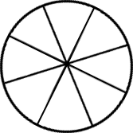

Imagine a circle. To encode the word codewars, we could split the circle into 8 parts (as `codewars `has 8 letters):



Then add the letters in a clockwise direction:

.png>)

Then remove the circle:
.png>)

If we read the result from left to right, we get `csordaew`.

Decoding is the same process in reverse. If we decode `csordaew`, we get `codewars`.

Examples:

```
encode "codewars" -> "csordaew"
decode "csordaew" -> "codewars"
encode "white" -> "wehti"
decode "wehti" -> "white"
```
